# Pengulingo - Front-End

[try it out here](https://pengulingo.onrender.com/)

[watch the demo vid here](https://www.youtube.com/watch?v=fjZj0D4-1LM&ab_channel=SelenaZhou)

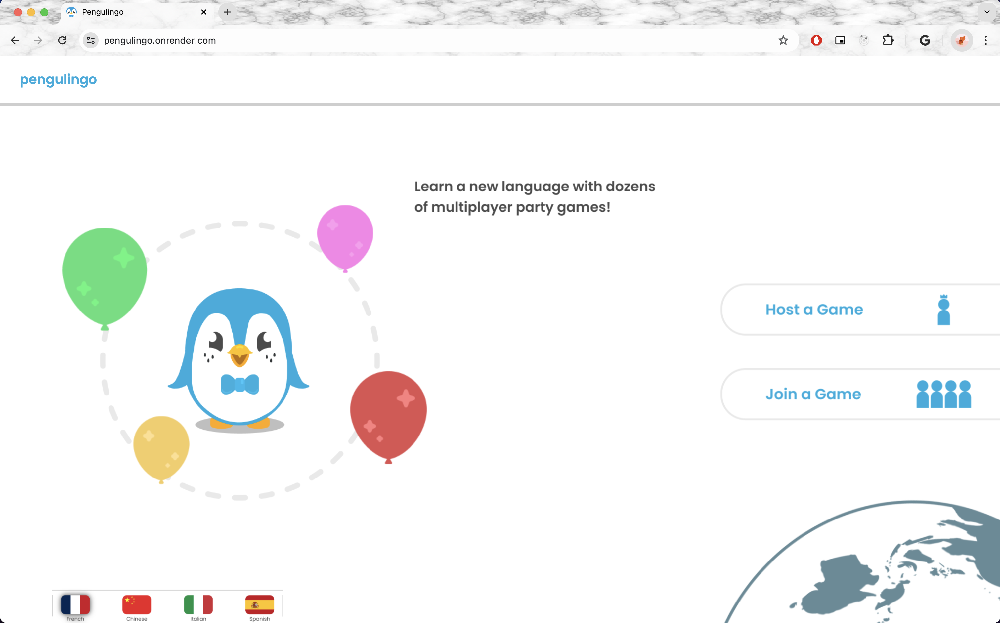

_Pengulingo_ is a multiplayer language learning arcade, designed as a mix between multiplayer games like Kahoot or Jackbox, and language learning apps like Duolingo. The goal is to learn languages through applying them in real-life scenarios, and create an interactive space for people to be more immersed in the language.

## Architecture

This repository is dedicated to the front-end of Pengulingo. We used React.js and MongoDB for back-end. All components are in `src/components`, with the main component being `App.jsx`. Each page is effectively a component. Zustand and Axios are the main libraries used.

## Deployment

_Pengulingo_ is deployed on Render.com at https://pengulingo.onrender.com/.

To deploy, enter the following:
- Build command: `npm install && npm run build`
- Publish directory: `dist`

For instructions on how to deploy the API, please see the README in `project-api-dueling-language-arcade`.

## Setup

To run locally, run commands `npm install && npm run build` to build the app. If connecting to MongoDB for back-end, ensure that the `ROOT_URL` in `src/components/store/gameSlice.js` is accurate. If using local host, make sure to download the `project-api-dueling-language-arcade` repository, and run `npm start`. Then, in `project-client-dueling-language-arcade`, run `npm run dev`.

## Game Flow Screen Caps

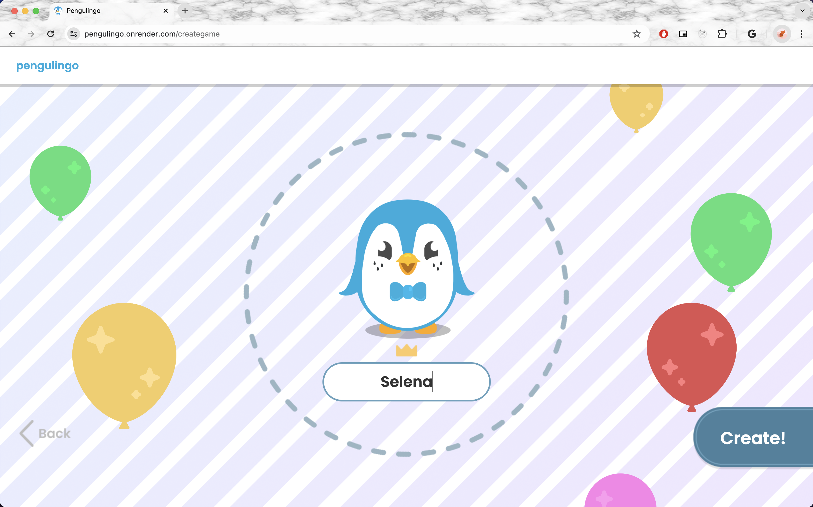
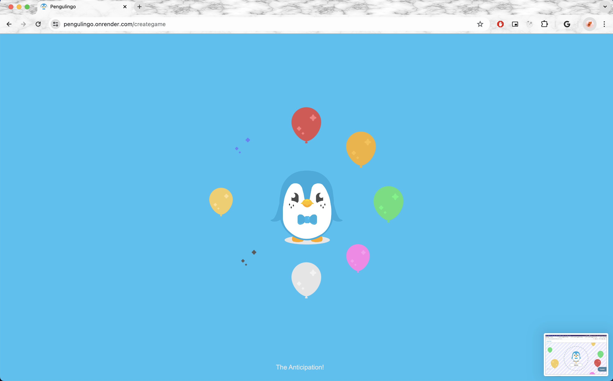
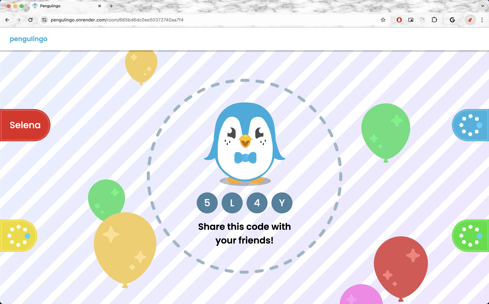
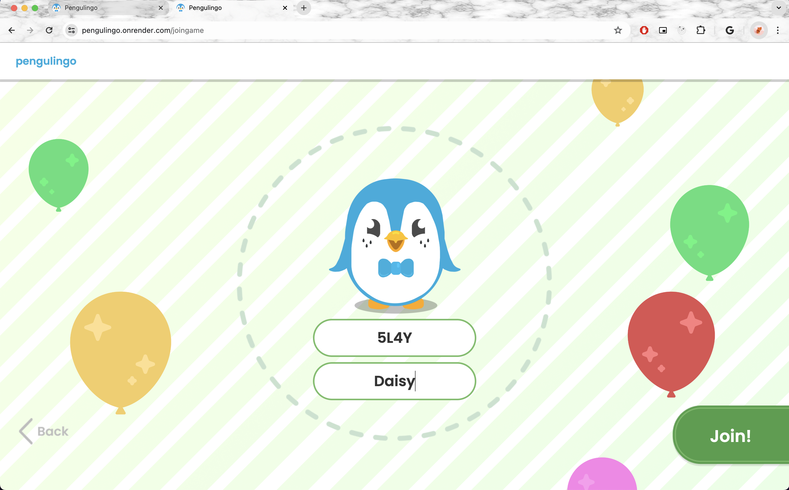
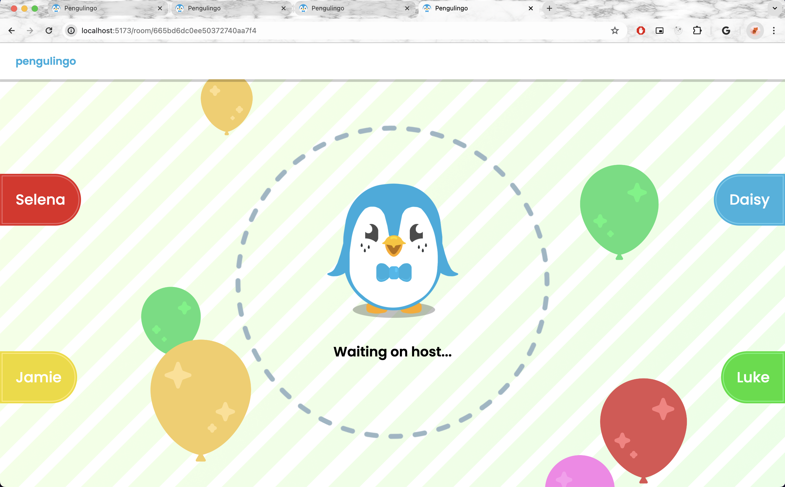
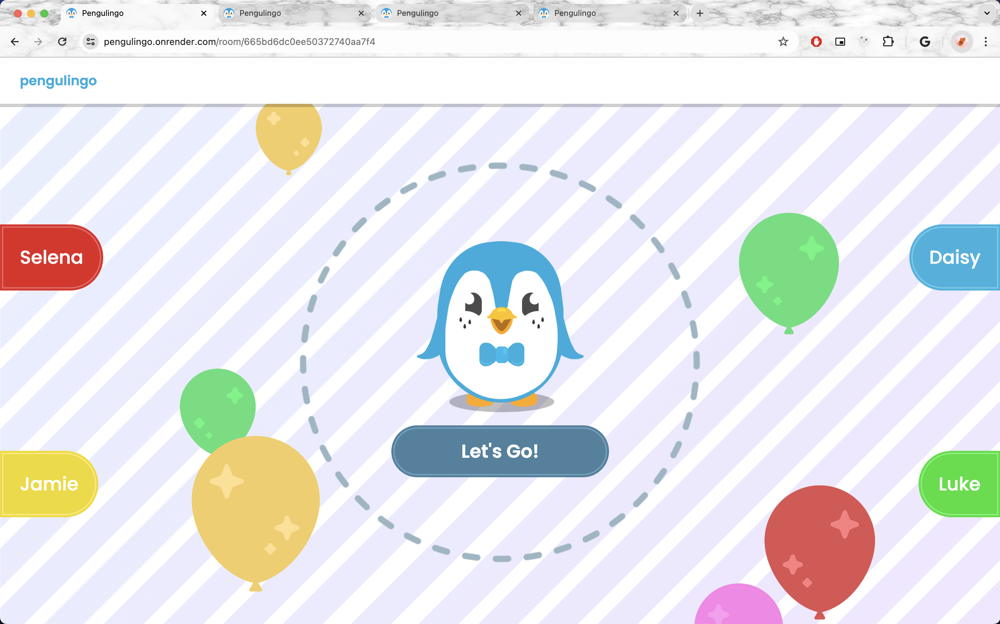
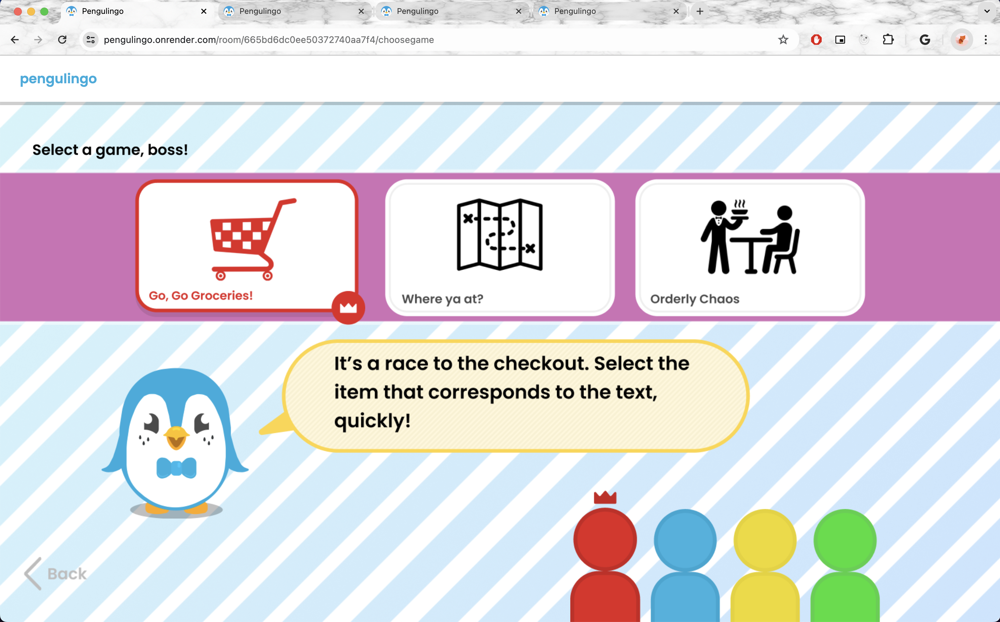
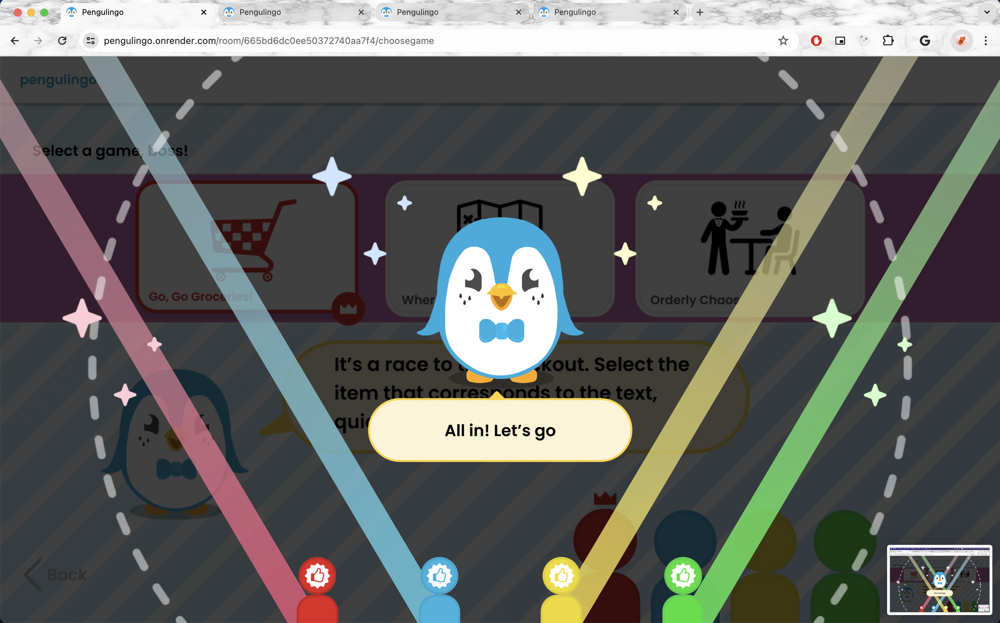
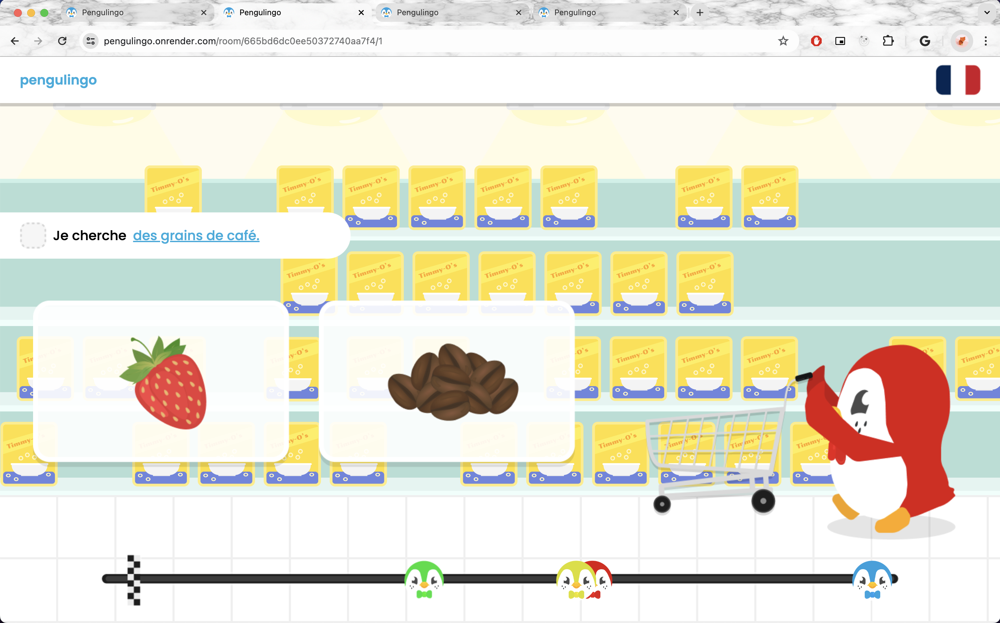
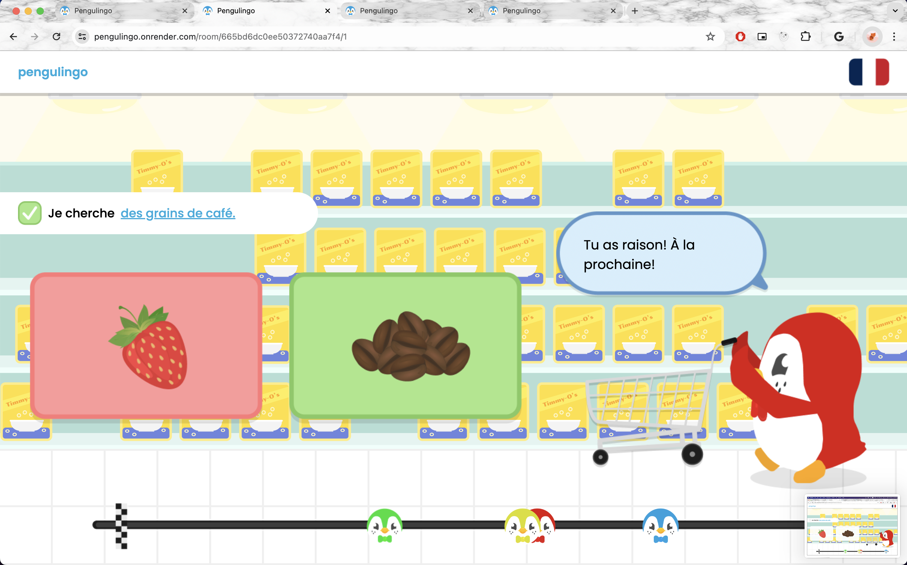
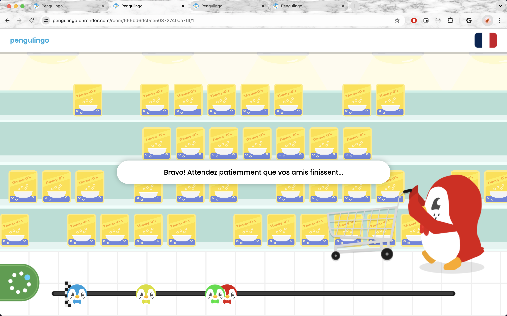
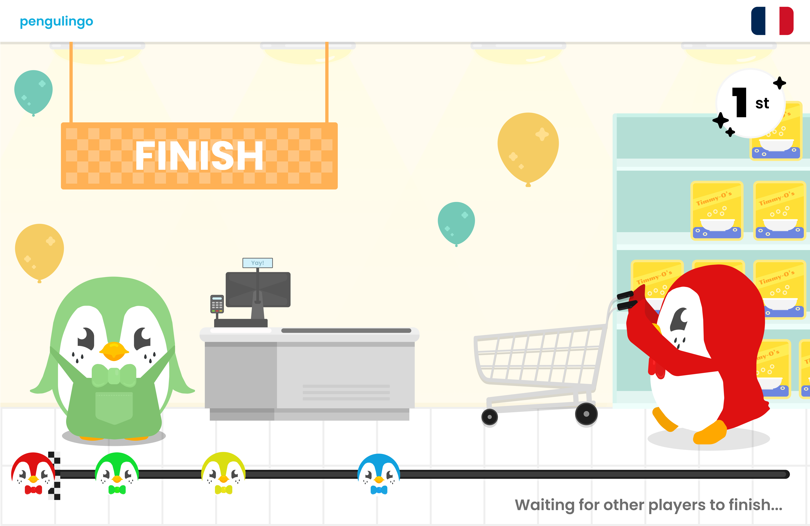
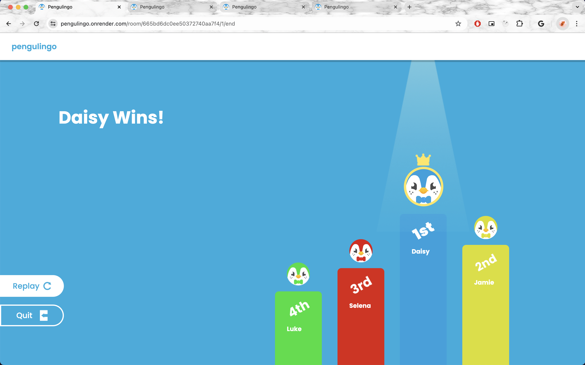

## Authors

**Luke Cargill:** graphic designer

**Selena Zhou:** PM, front-end & wiring

**Daisy Li:** back-end & store

**Jamie Nicholson:** front-end & animations

## Acknowledgments

Prof Tim Tregubov for bringing us together in CS52!
